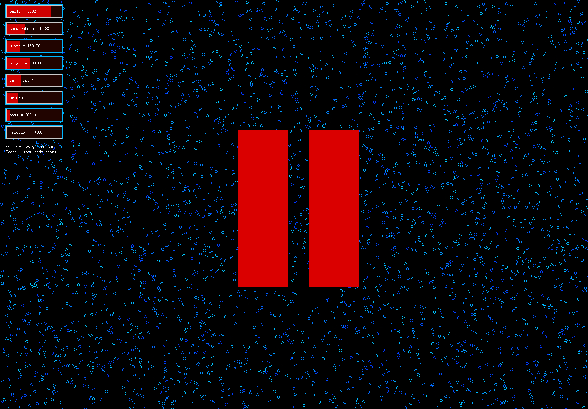

# Brownian Motion Simulator



To compile, first install Go, open terminal, go to the folder with this repository files and run:
```
go mod tidy
go run .
```

or, to produce a binary executable:
```
go build .
```

The program should work on Mac, Linux and Windows.

Riga.

January, 2025

By Arturs Jefimovs and Patriks Aleksandrjans

Latvian State University
